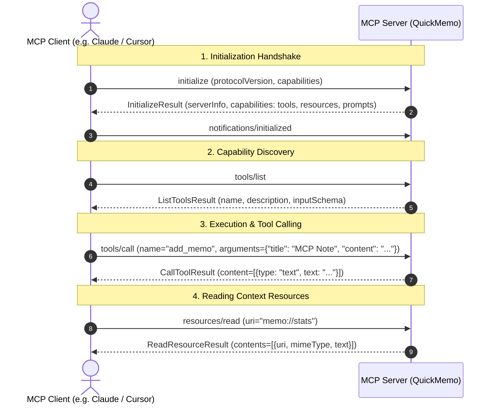

# Model Context Protocol (MCP) Fundamentals & Architecture Guide

A comprehensive, accessible technical overview of the Model Context Protocol (MCP) specification, client-server lifecycle, core primitives, and transport protocols.

---

## 1. What is Model Context Protocol (MCP)?

**Model Context Protocol (MCP)** is an open, standardized protocol created by Anthropic that allows AI models and host applications (such as Claude Desktop, Cursor, Antigravity, or custom developer tools) to securely connect to external tools, data sources, and context providers.

Before MCP, integrating an AI client with third-party data (databases, local filesystems, APIs, or dev utilities) required bespoke plugins for every individual AI interface. MCP acts as the **"USB-C standard for AI"**, establishing a universal interface for tool calling, resource inspection, and prompt templates.

```
+-------------------------------------------------------------------------------+
|                                  MCP CLIENTS                                  |
|         Claude Desktop   |   Cursor   |   Antigravity   |   Custom IDE        |
+-------------------------------------------------------------------------------+
                                       ▲
                                       │  Universal JSON-RPC 2.0
                                       ▼
+-------------------------------------------------------------------------------+
|                                  TRANSPORTS                                   |
|               stdio (Local Process)   |   SSE / Streamable HTTP               |
+-------------------------------------------------------------------------------+
                                       ▲
                                       │
                                       ▼
+-------------------------------------------------------------------------------+
|                                  MCP SERVERS                                  |
|      QuickMemo MCP       |   Playwright MCP    |    Context7    |   GitHub    |
|  (Tools, Resources, Prompts)                                                  |
+-------------------------------------------------------------------------------+
```

---

## 2. The Three Core MCP Primitives

MCP standardizes three distinct capabilities that a server can expose:

### A. Tools (Model-Controlled Actions)
- **What they are**: Executable functions that the AI model can actively decide to invoke during its reasoning process.
- **Direction**: Model $\rightarrow$ Server $\rightarrow$ Model.
- **Example in QuickMemo**: `add_memo`, `list_memos`, `search_memos`, `delete_memo`.
- **JSON-RPC Methods**: `tools/list`, `tools/call`.

### B. Resources (Application-Controlled Context)
- **What they are**: URI-addressable static or dynamic data streams that can be attached directly into the model's context window.
- **Direction**: Client / User $\rightarrow$ Server $\rightarrow$ Context.
- **URI Format**: `scheme://path` (e.g. `memo://all`, `memo://stats`).
- **JSON-RPC Methods**: `resources/list`, `resources/read`, `resources/templates/list`.

### C. Prompts (User-Controlled Templates)
- **What they are**: Reusable, parameterized prompt templates that guide the model through multi-step workflows.
- **Direction**: User $\rightarrow$ Client $\rightarrow$ Model.
- **Example in QuickMemo**: `review_notes(category)`, `daily_standup()`.
- **JSON-RPC Methods**: `prompts/list`, `prompts/get`.

---

## 3. Transports & Communication Flow

MCP supports two primary transport layers:

1. **`stdio` (Standard Input / Output)**:
   - The MCP client spawns the server as a local child process.
   - Messages are serialized as newline-delimited JSON-RPC 2.0 payloads over standard input and standard output.
   - Ideal for local desktop tools, CLI utilities, and zero-network security requirements.

2. **`SSE` (Server-Sent Events) & Streamable HTTP**:
   - The MCP server runs as a standalone web service.
   - The client connects via an SSE stream to receive events and sends JSON-RPC requests via HTTP POST.
   - Ideal for remote cloud services, multi-user deployments, and SaaS integrations.

---

## 4. MCP JSON-RPC 2.0 Handshake Lifecycle



---

## 5. Primitives Comparison Summary

| Primitive | Triggered By | Primary Purpose | Return Type |
| :--- | :--- | :--- | :--- |
| **Tool** | The AI Model | Performing actions, mutations, computations | Text, images, structured data |
| **Resource** | The User / Host | Attaching read-only background context & telemetry | Plain text, JSON, binary |
| **Prompt** | The User / UI | Standardized task templates & workflows | Messages list (role + content) |
