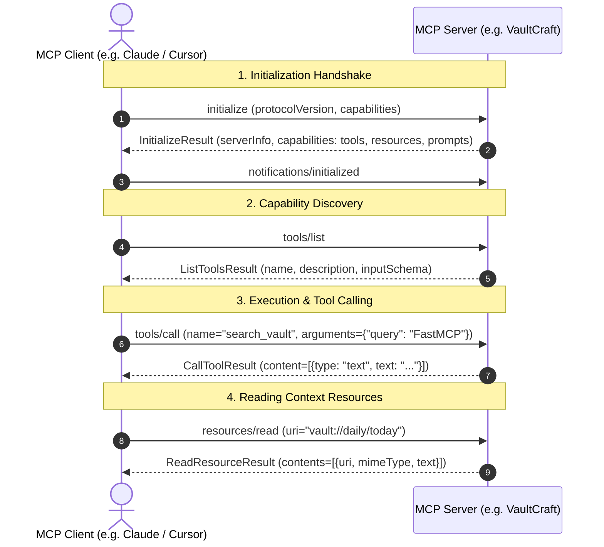

# Model Context Protocol (MCP) Fundamentals & Architecture Guide

A comprehensive technical overview of the Model Context Protocol (MCP) specification, client-server lifecycle, core primitives, and transport protocols.

---

## 1. What is Model Context Protocol (MCP)?

**Model Context Protocol (MCP)** is an open, standardized protocol created by Anthropic that allows AI models and clients (such as Claude Desktop, Cursor, Antigravity, or custom IDEs) to securely connect to external tools, data sources, and context providers.

Before MCP, every integration (GitHub, Postgres, Slack, Playwright, Local Filesystem) required bespoke plugins and custom APIs for each individual AI tool. MCP unifies all integrations under a single, universal standard.

```
+-------------------------------------------------------------------------------+
|                                  MCP CLIENTS                                  |
|         Claude Desktop   |   Cursor   |   Antigravity   |   Custom App        |
+-------------------------------------------------------------------------------+
                                       ▲
                                       │  Universal JSON-RPC 2.0
                                       ▼
+-------------------------------------------------------------------------------+
|                                  TRANSPORTS                                   |
|               stdio (Local Process)   |   SSE / Streamable HTTP               |
+-------------------------------------------------------------------------------+
                                       ▲
                                       │
                                       ▼
+-------------------------------------------------------------------------------+
|                                  MCP SERVERS                                  |
|      VaultCraft MCP      |   Playwright MCP    |   PostgreSQL   |   GitHub    |
|  (Tools, Resources, Prompts)                                                  |
+-------------------------------------------------------------------------------+
```

---

## 2. The Three Core MCP Primitives

MCP standardizes three distinct capabilities that a server can expose:

### A. Tools (Model-Controlled Actions)
- **What they are**: Functions that the AI model can actively choose to call to perform actions or computations.
- **Direction**: Model $\rightarrow$ Server $\rightarrow$ Model.
- **Example in VaultCraft**: `create_or_update_note`, `search_vault`, `find_backlinks`, `delete_note`.
- **JSON-RPC Methods**: `tools/list`, `tools/call`.

### B. Resources (Application-Controlled Data Streams)
- **What they are**: URI-addressable static or dynamic data streams that can be attached directly into the model's context window.
- **Direction**: Client / User $\rightarrow$ Server $\rightarrow$ Context.
- **URI Format**: `scheme://path` (e.g. `vault://notes/{title}`, `vault://daily/today`, `vault://graph/overview`).
- **JSON-RPC Methods**: `resources/list`, `resources/read`, `resources/templates/list`.

### C. Prompts (User-Controlled Templates)
- **What they are**: Pre-written prompt templates that guide the model through complex, multi-step workflows.
- **Direction**: User $\rightarrow$ Client $\rightarrow$ Model.
- **Example in VaultCraft**: `synthesize_concept(tag)`, `daily_standup()`, `knowledge_gap_analysis()`.
- **JSON-RPC Methods**: `prompts/list`, `prompts/get`.

---

## 3. Transports & Communication Flow

MCP supports multiple transport mechanisms:

1. **`stdio` (Standard Input / Output)**:
   - Client spawns the server as a child process.
   - Messages are serialized as newline-delimited JSON-RPC 2.0 objects over `stdin` / `stdout`.
   - Ideal for local tools, CLI utilities, and zero-network overhead.

2. **`SSE` (Server-Sent Events) & Streamable HTTP**:
   - Server runs as an HTTP service.
   - Client connects via SSE stream for incoming server events and sends HTTP POST requests for client messages.
   - Ideal for remote services, cloud hosting, and multi-client environments.

---

## 4. MCP JSON-RPC 2.0 Handshake Lifecycle



---

## 5. Summary Comparison

| Concept | Who Initiates? | Primary Purpose | Return Type |
| :--- | :--- | :--- | :--- |
| **Tool** | The AI Model | Performing actions, calculations, mutations | Result text, images, resources |
| **Resource** | The User / Client | Attaching background data, documents, telemetry | Raw text, binary, JSON |
| **Prompt** | The User / UI | Standardized task templates & workflows | Messages list (role + content) |
